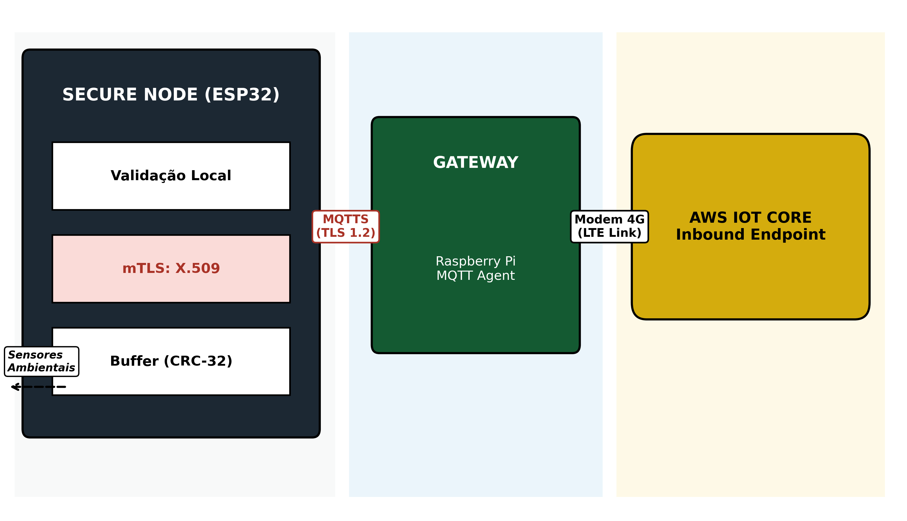

# Edge-IoT NIS2-Hardened Architecture

Este repositório contém materiais de apoio ao artigo:

**"Arquitetura Edge-IoT Resiliente e NIS2-Hardened para Monitoramento Ambiental em Infraestruturas Críticas"**

---

## 📌 Descrição

Esta proposta apresenta uma arquitetura Edge-IoT de baixo custo, projetada para ambientes de infraestrutura crítica, com foco em resiliência operacional e segurança embarcada alinhada à diretiva NIS2.

A solução foi validada em um testbed real, demonstrando capacidade de operação resiliente mesmo sob falhas de conectividade.

A arquitetura integra:
- Validação de dados na borda
- Comunicação resiliente (store-and-forward)
- Criptografia AES-256-GCM
- Hardening de firmware (secure boot, desativação de debug)
- Cluster distribuído com gateway central

---

## 🧱 Arquitetura

A arquitetura é composta por:
- 10 nós sensores (ESP32)
- 1 gateway (Raspberry Pi Zero W)
- Armazenamento local com sincronização posterior

Mais detalhes podem ser encontrados em [`/docs/arquitetura.md`](docs/arquitetura.md)

---

## 🔁 Lógica de Resiliência

A lógica de operação segue o modelo:

- Operação online: envio direto
- Falha de conectividade: armazenamento local
- Recuperação: sincronização automática

Ver pseudocódigo em [`/src/pseudocode.txt`](src/pseudocode.txt)

---

## 📊 Dados de Experimento

O diretório [`/data`](data/) contém amostras simplificadas das medições de latência utilizadas no artigo.

---

## 🚀 Resultados Experimentais

A arquitetura foi validada em um testbed real, apresentando:

- 100% de recuperação de dados em cenários de falha
- Redução significativa de latência em comparação com arquitetura baseada em nuvem
- Operação resiliente sob perda de conectividade

Os dados completos e metodologia detalhada encontram-se descritos no artigo submetido à REIC.

---

## 📎 Repositório Acadêmico

Este repositório tem finalidade de documentação científica e reprodutibilidade parcial, contendo:

- Estrutura da solução
- Lógica de funcionamento
- Dados representativos

A implementação completa pode ser expandida em trabalhos futuros.

---

## 🔗 Artigo

Submetido à Revista Eletrônica de Iniciação Científica em Computação (REIC).

---

## 📄 Licença

MIT License